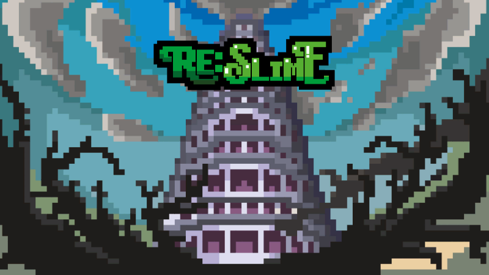

# **RE:SLIME** 
 `"RE:SLIME"은 탑을 오르고 싶은 슬라임의 우당탕탕 로그라이크 게임입니다.`

 

 # 👉 [게임 다운로드](https://drive.google.com/drive/folders/1GlMkwE-vH56ZygiUaKQ44f1GGHqLGWK5?usp=sharing) (v23.08.12)
- 파일 압축 해제 후 'RE-SLIME.exe' 파일로 실행하시면 됩니다.

# 👉 [게임 피드백](https://docs.google.com/forms/d/1rpwRQ28UtLBdLxTIu_FuOAB2LlZWLX3MlIbZxzw4j6w/edit)
- 게임 플레이와 피드백은 저를 춤추게 합니다.
- 혼자 개발하는 뉴비 개발자라 버그나, 편의사항에서 많이 부족한 점이 있지만 수정하려고 노력중입니다. 마음껏 피드백 해주세요 !

## 장비 시스템
- 해골 상점에는 여러가지 다양한 장비가 기다리고 있습니다.
- 최고의 장비 조합을 먹어보세요. 물론 마구마구 먹을 수는 없답니다. 배탈 조심하세요 !
- 장비는 공격력, 방어력 같은 스탯을 올려주거나, 원거리 공격, 투명화 같은 특별한 스킬을 사용하게 해줄 수 있습니다.

## 게임 진행
- 슬라임 왕, 해골 상점이 있는 탑의 0층부터 마왕이 있는 100층까지 올라가면 됩니다. 간단하죠 ?
- 슬라임이 체력적으로 버틸 수 있을까요? 1초에 1씩 체력이 감소합니다.
- 슬라임 펀치로 무엇이든 할 수 있죠. 몬스터를 혼내주거나 벽을 부셔보세요.
- 매 판 무작위로 소환되는 몬스터와 방해물들, 그리고 거대한 보스 몬스터까지.

## 게임 정보
### 몬스터
- 귀엽게 생겼지만, 몬스터들을 조심하세요. 그들은 슬라임을 따라다니거나, 뭔가를 쏘거나, 심지어는 숨어서 지켜보고 있답니다...!
- 던전을 여행할 용사를 위해 이 정보를 남깁니다...

| 층 수 | 테마 | 몬스터|
|--|--|--|
| 1 ~ 20 | 탑 하단부 | 거미, 해골병사, 박쥐, 개구리, 바위 |
| 21 ~ 40 | 으슬으슬한 묘지 | 유령, 좀비, 허수아비, 늑대인간, 늑대 |
| 41 ~ 60 | 용암 대지 | 불씨, 불박쥐, 마그마뱀, 골렘, 불예티
| 61 ~ 80 | 마법 왕궁 | 마녀, 대마법사, 경비병, 움직이는 책, 양초
